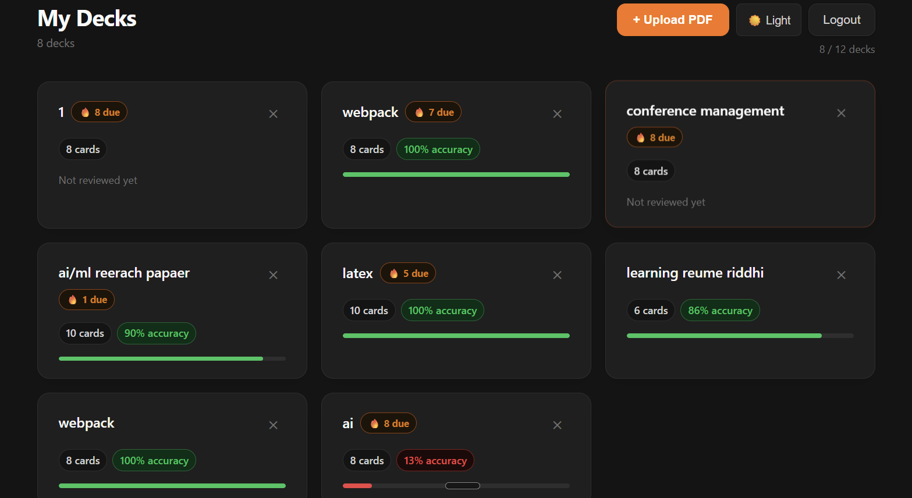
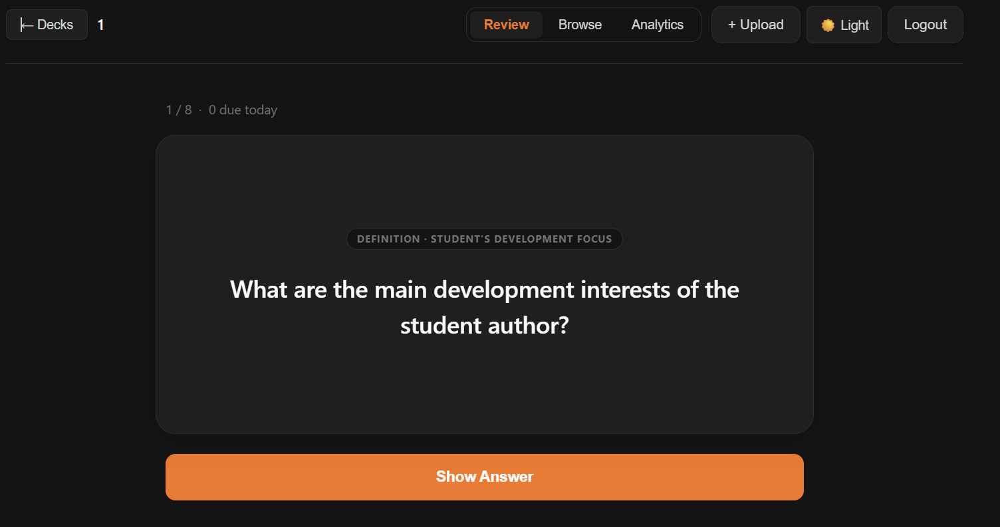
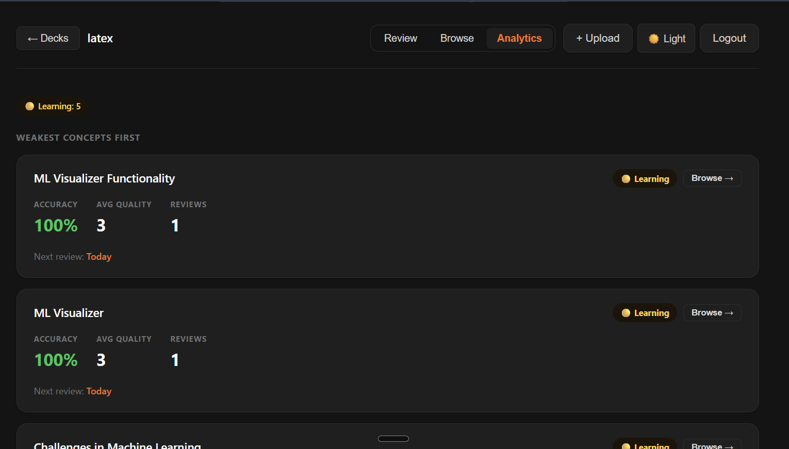

# FlashCard AI

A full-stack PDF-to-flashcard system powered by Google Gemini and SM-2 spaced repetition. Upload any PDF, get AI-generated flashcards instantly, and study smarter with an adaptive review schedule that surfaces the right cards at the right time.

---

## Features

- **PDF Upload & AI Generation** — Upload a PDF and Gemini 2.5 Flash generates 6–10 targeted flashcards per document chunk
- **Deck-Based Organization** — Cards are grouped into decks; each deck tracks progress independently
- **Flashcard Review Mode** — Anki-style flip experience: see the question, reveal the answer, rate your recall (0–5)
- **SM-2 Spaced Repetition** — Cards are rescheduled based on recall quality; well-known cards surface less often, weak cards return sooner
- **Browse Mode** — Read-only card viewer for manual revision without affecting the review schedule
- **Analytics Dashboard** — Per-concept status tracking (New / Learning / Reviewing / Mastered / Needs Revision), accuracy rates, and next review times
- **Diagram-Aware Generation** — Chunks referencing figures and charts are detected and handled with a dedicated prompt, generating conceptual cards without OCR or image processing
- **Next Review Visibility** — Every reviewed card shows when it will next appear ("In 3 days", "Tomorrow", "Due now")
- **Per-User Isolation** — JWT authentication; each user sees only their own decks, cards, and progress

---

## Screenshots


| Deck List | Review Mode | Analytics |
|-----------|-------------|-----------|
|  |  |  |

---

## Tech Stack

| Layer | Technology |
|-------|------------|
| Frontend | React 18, Vite 5 |
| Backend | Node.js, Express 4 |
| Database | MongoDB, Mongoose 8 |
| AI | Google Gemini 2.5 Flash (REST API) |
| Auth | JWT (`jsonwebtoken`), `bcryptjs` |
| PDF Parsing | `pdf-parse` |
| File Upload | `multer` (memory storage) |

---

## Architecture Overview

```
PDF Upload
   │
   ▼
pdf-parse (text extraction, max 25 pages)
   │
   ▼
Text Chunker (500 words/chunk, max 20 chunks)
   │
   ├── Normal chunk ──► Gemini SYSTEM_PROMPT ──► 6–10 cards
   └── Diagram chunk ──► Gemini DIAGRAM_PROMPT ──► 1–2 conceptual cards
                              │
                              ▼
                       Card validation & normalization
                              │
                              ▼
                    MongoDB  (Deck / Card / CardProgress)
                              │
                              ▼
                    SM-2 Review Engine
                    (ease factor, interval, repetitions)
                              │
                              ▼
                    React UI  (Review / Browse / Analytics)
```

---

## Key Design Decisions

**SM-2 Spaced Repetition**
SM-2 is the algorithm behind Anki and has decades of empirical support for long-term retention. It was chosen over simpler interval systems because it adapts per-card based on recall quality rather than applying a fixed schedule, making it effective across content types.

**Deck-Based Structure**
Grouping cards by source document mirrors how people naturally organise study material. It allows per-deck analytics, scoped review sessions, and clean data isolation without complex filtering.

**Text-Based Diagram Handling**
True image understanding would require a vision model or OCR pipeline, adding latency, cost, and infrastructure complexity. Instead, diagram-adjacent chunks (identified by low word count + figure/chart keywords) are sent to Gemini with a prompt that infers the conceptual meaning from surrounding text. This produces useful cards without image access and keeps the pipeline fully text-based.

---

## Tradeoffs

| Tradeoff | Decision |
|----------|----------|
| No image understanding | Diagram cards are conceptually inferred from text context — accurate for well-captioned figures, limited for unlabelled visuals |
| PDF size cap | Files over 10 MB are rejected; PDFs over 25 pages are truncated with a warning — balances API cost and generation quality |
| No semantic search | Cards are browsed and reviewed by deck/concept — full-text search is not implemented |
| Simplicity over pipelines | No background job queue; generation is synchronous per upload — suitable for single-user or small-team use |

---

## Setup Instructions

### Prerequisites

- Node.js v18+
- MongoDB (local or Atlas)
- Google Gemini API key

### 1. Clone the repository

```bash
git clone https://github.com/riddhivinayak/Flash_Card.git
cd Flash_Card
```

### 2. Install dependencies

```bash
# Backend
npm install

# Frontend
cd client && npm install && cd ..
```

### 3. Configure environment variables

```bash
cp .env.example .env
```

Edit `.env` and fill in the required values (see [Environment Variables](#environment-variables) below).

### 4. Run the application

```bash
# Development (backend + frontend concurrently)
npm run dev
```

The backend runs on `http://localhost:3000` and the Vite dev server proxies API requests automatically.

---

## Environment Variables

Create a `.env` file in the project root:

```env
# Google Gemini API
GEMINI_API_KEY=your_gemini_api_key_here

# MongoDB connection string
MONGODB_URI=mongodb://localhost:27017/flashcard

# JWT secret (use a long random string in production)
JWT_SECRET=your_jwt_secret_here

# Server port (optional, defaults to 3000)
PORT=3000
```

> A `.env.example` file is included in the repository with all required keys and no values.

---

## API Overview

All routes under `/api/decks` and `/api/reviews` require a `Bearer` token in the `Authorization` header.

### Decks

| Method | Endpoint | Description |
|--------|----------|-------------|
| `POST` | `/api/decks/upload` | Upload a PDF and generate a deck |
| `GET` | `/api/decks` | List all decks for the authenticated user |
| `GET` | `/api/decks/:id` | Get a single deck with card count and due count |
| `GET` | `/api/decks/:id/cards` | Get all cards in a deck |
| `GET` | `/api/decks/:id/analytics` | Get per-concept analytics for a deck |
| `DELETE` | `/api/decks/:id` | Delete a deck and all associated data |

### Review

| Method | Endpoint | Description |
|--------|----------|-------------|
| `GET` | `/api/decks/:id/review` | Get the current review session (due cards) |
| `POST` | `/api/reviews` | Submit a review rating and update SM-2 progress |

### Auth

| Method | Endpoint | Description |
|--------|----------|-------------|
| `POST` | `/api/auth/register` | Create a new account |
| `POST` | `/api/auth/login` | Authenticate and receive a JWT |

---

## Future Improvements

- **Vision-based diagram understanding** — Pass diagram images to a multimodal model for richer card generation
- **Mobile UI** — Responsive layout and touch-friendly card flipping
- **Card quality filtering** — Let users flag or edit low-quality generated cards before reviewing
- **Search & filters** — Full-text search across cards; filter by concept, status, or difficulty
- **Export** — Download decks as CSV or Anki-compatible `.apkg`
- **Async generation** — Background job queue (e.g. Bull) to handle large PDFs without blocking the HTTP response

---

## Security Notes

- `.env` is listed in `.gitignore` and never committed
- API keys are only accessed server-side; the frontend receives no credentials
- Passwords are hashed with `bcryptjs` before storage
- JWT tokens expire after 7 days
- All deck, card, and review queries are scoped to `req.userId` from the verified token — users cannot access other users' data

---

## Author

**Riddhi Vinayak**
[github.com/riddhivinayak](https://github.com/riddhivinayak)
